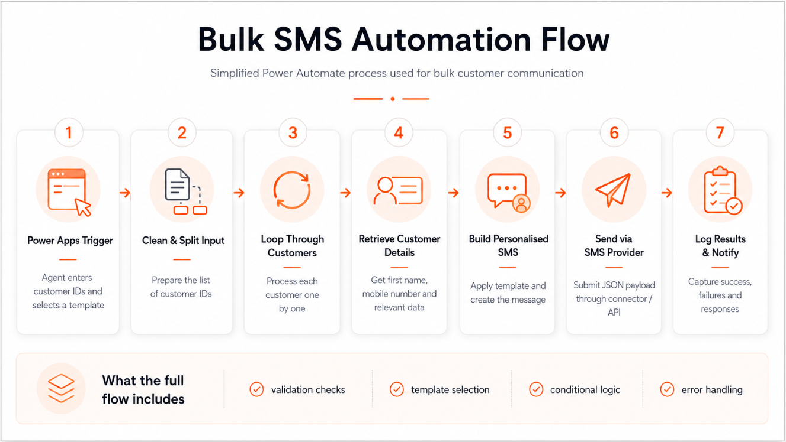
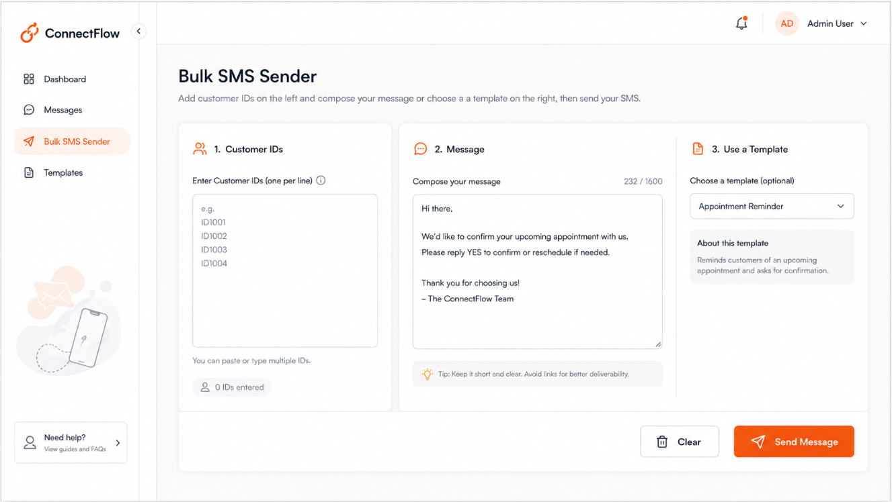
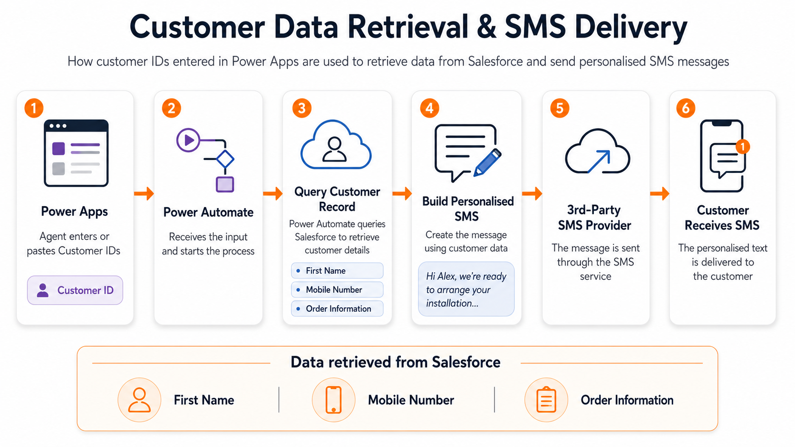
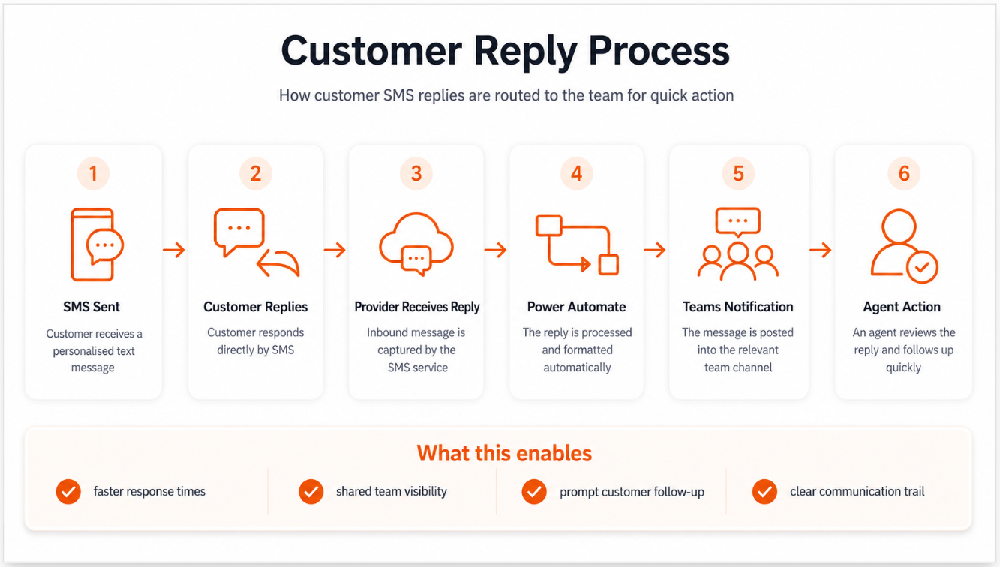

# Bulk SMS Communication App

## Project Overview

I designed and built a **Power Apps and Power Automate solution** to help customer-facing teams contact customers faster.

The project started as a small experiment to replace a slow, manual email process with **bulk personalised SMS messages**.

After strong results, the solution was adapted for other teams and later expanded to support **two-way SMS communication**.

---

## Business Problem

Customer-facing teams often needed to contact customers quickly, for example to arrange an installation after an order had been placed.

The existing process relied on individual emails sent through Salesforce.

For every customer, an agent had to:

1. Open the customer record
2. Select the email option
3. Find the correct template
4. Send the email
5. Repeat the process for the next customer

This was time-consuming and customer response rates were low.

The goal was to create a faster way to contact multiple customers while keeping each message personalised.

---

## Solution

I created a **Power Apps interface** where agents could:

- Paste a list of Customer IDs
- Select an SMS template
- Send personalised messages in bulk

The app passed the information to **Power Automate**, which handled customer lookup, message creation and delivery.

### Process Flow



---

## How It Works

### Power Apps Interface

I designed a simple interface focused on speed and ease of use.

Agents could enter multiple Customer IDs and choose the required message from a dropdown.

The selected values were then passed to Power Automate.



---

### Customer Data Retrieval

Power Automate processed each Customer ID and retrieved the information needed for the message.



This allowed each SMS to be personalised automatically.

---

### Dynamic Templates

Instead of writing each message manually, agents selected a predefined template.

For example:

```text
Hi {FirstName},

We are ready to arrange your installation.

Please contact our team to book your appointment.
```

Power Automate replaced the placeholders with the correct customer information before sending the message.

---

### SMS Integration

The message was sent through a third-party SMS service connected to Power Automate.

A simplified JSON request looked like this:

```json
{
  "to": "+447700000000",
  "message": "Hi Alex, we are ready to arrange your installation. Please contact our team to book your appointment."
}
```

The full process also included validation and error handling before the message was sent.

---

## Two-Way SMS Communication

The original solution focused on outbound messages.

After it proved successful, I extended the process so customers could **reply directly by SMS**.

Their responses were automatically processed by Power Automate and posted into a dedicated Microsoft Teams channel.



This allowed agents to see customer replies quickly and take action without checking a separate system.

---

## Results

The initial test showed a clear improvement in customer engagement:

- **Over 12% response rate within the first hour**
- **Around 20% overall response rate**
- Reduced manual customer contact
- Allowed multiple customers to be contacted in one process
- Made customer replies easier for teams to monitor and action

The success of the first version led other teams to request similar solutions for their own customer journeys.

---

## From Experiment to Wider Adoption


What started as a single use case became a reusable solution that could be adapted for different teams and communication needs.

---

## Tools Used

| Tool | Purpose |
|---|---|
| **Power Apps** | Agent interface |
| **Power Automate** | Workflow and business logic |
| **Salesforce** | Customer and order data |
| **SMS API / Connector** | Sending and receiving SMS |
| **JSON** | API request structure |
| **Microsoft Teams** | Customer reply notifications |

---

## Key Business Logic

The flow handled:

- Multiple Customer IDs
- Customer record lookup
- Mobile number validation
- Template selection
- Message personalisation
- SMS delivery
- Success and failure handling
- Incoming customer replies
- Routing responses to the correct team

A simplified version of the logic:

```text
For each Customer ID

    Find customer

    If valid mobile number exists
        Get selected template
        Add customer details
        Send SMS
    Else
        Record as unable to contact
```

---

## Skills Demonstrated

- Power Apps development
- Power Automate workflow design
- API integration
- JSON
- Salesforce integration
- Data validation
- Dynamic templates
- Bulk processing
- Error handling
- User interface design
- Process improvement

---

## Business Impact

This project replaced a repetitive manual process with a faster and more scalable communication method.

It also showed how a solution built for one specific problem could be reused across different teams and later expanded into a **two-way customer communication process**.
